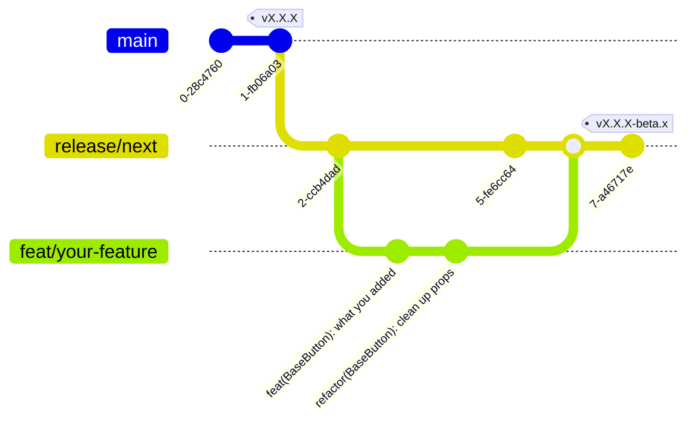

# Contributing to Shuriken UI - Nuxt

Thanks for taking the time to contribute! 🎉

In this guide you will find all the information you need to contribute to the project.

## What is Shuriken UI Nuxt?

Shuriken UI Nuxt is part of the Shuriken UI project by [Css Ninja](https://github.com/cssninjaStudio). It goal is to provide a set of components to build a apps with Nuxt.js using the Shuriken UI design system.


## New contributor guide

Components in Shuriken UI Nuxt are built using Shuriken UI Tailwind which declare some components (prefixed with `nui-`) in tailwind plugins. This allow to use the same components in different frameworks and let tailwind jit to include only used styles.

If you find a bug or want to add new features, makes sure to check if it can be fixed or added in Shuriken UI Tailwind first.

Also, note that we use `release/next` branch to develop new features. If you want to contribute, make sure to create a new branch from `release/next` and to submit your pull request to `release/next` branch. (see [Git conventions](#git-conventions))

If you have any doubt or questions, feel free to [open a discussion](https://github.com/shuriken-ui/nuxt/discussions).

## Setup the project

We use [pnpm](https://pnpm.io/) to manage our dependencies. Make sure to install it first.

```bash
corepack enable
corepack prepare pnpm@latest --activate
```

> **Note**
> Corepack is installed with Node.js from v16.9.x.
> If your version is below, install it with: `npm install -g corepack`

Then install the dependencies:

```bash
pnpm install
```

Now you can start the playground which is a Nuxt.js app using Shuriken UI Nuxt.

```bash
pnpm dev
```

Everything is ready, you can start coding! 🎉

Don't forget to run the tests after your changes to make sure everything is working as expected.

```bash
pnpm test
```

### Link Shuriken UI Tailwind

If you need to update Shuriken UI Tailwind, you can link it to the playground by editing `nuxt.config.ts` at the root of the project:

```diff
import { createResolver } from '@nuxt/kit'
-import { withShurikenUI } from '@shuriken-ui/tailwind'
+import { withShurikenUI } from '../path/to/shuriken-ui/tailwind/src'

const { resolve } = createResolver(import.meta.url)

export default defineNuxtConfig({
```

> **Warning**
> Make sure to remove the link before committing your changes.

## Submitting your changes

Once you are done with your changes, you can submit a pull request, also known as a PR.

- Make sure the tests pass locally by running `pnpm test`, this will run typescript check and the linter.
- Make sure to create a draft PR if it's not ready to be merged, see [how to change stage of a PR](https://docs.github.com/en/pull-requests/collaborating-with-pull-requests/proposing-changes-to-your-work-with-pull-requests/changing-the-stage-of-a-pull-request)
- Make sure to add a description of your changes, if relevant, add screenshots or gifs to illustrate your changes.
- Don't forget to [link PR to issue](https://docs.github.com/en/issues/tracking-your-work-with-issues/linking-a-pull-request-to-an-issue) if you are solving one.
- Enable the checkbox to [allow maintainer edits](https://docs.github.com/en/github/collaborating-with-issues-and-pull-requests/allowing-changes-to-a-pull-request-branch-created-from-a-fork) so the branch can be updated for a merge. Once you submit your PR, a Shuriken UI maintainer will review your proposal. We may ask questions or request additional information.
- We may ask for changes to be made before a PR can be merged, either using [suggested changes](https://docs.github.com/en/pull-requests/collaborating-with-pull-requests/reviewing-changes-in-pull-requests/incorporating-feedback-in-your-pull-request) or pull request comments. You can apply suggested changes directly through the UI. You can make any other changes in your fork, then commit them to your branch.

## Git conventions

We use [conventional commits](https://www.conventionalcommits.org/en/v1.0.0/) to make our commits more readable and to generate our changelog.

Make sure to prefix your commit with one of the following types:
`fix:`, `feat:`, `build:`, `chore:`, `ci:`, `docs:`, `style:`, `refactor:`, `perf:`, `test:`

Use the imperative, present tense: “change” _not “changed” nor “changes”_.


